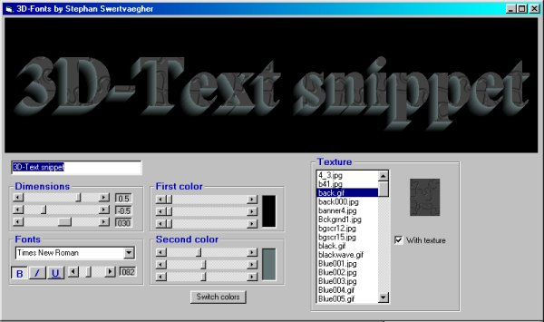



## Cool 3D\-Text\(ure\)

### Description

This prg has a sub to make a 3D-effect of any font you like...

Textured or just a plain gradient.

Ofcourse, to speed things up, some API are used.

No vbogl12 (that contains OpenGl Api1.2) needed... (sorry matt).

The sub is stored in the module, and easy to use and understand.

The code is quite simple, but very effective.

The text can be designed REAL-Time, even when you write it. With the scrollbars

change-event, the 3D-text is updated at the same time.

In the module, you'll find also a function to read all the fonts and store them in a combobox.

This works very fast (faster then the CommonDialog Showfont method), even when you have

about 750 fonts - like I do ;). The fontsize can go up to 200 pixels.

Anyway, with a small modification, you can save this: SavePicture Pic1.Image, Path & "\name.bmp".

So this prg can even be modified to a 3D-text designer, and save the pictures as a bitmap file.

Maybe I'll do that someday, who knows ?

Note that the backgroundcolor is black (= RGB(0, 0, 0), = &H0, = vbBlack), so this can be used as a mask.

Extract this zip with path included, there are some textures in the zip. Be sure to check it out.

Comments are always welcome, as usual. E-mail adress in the module. Have fun.
 
### More Info
 

             |
---                |---
**Submitted On**   |2001-05-30 15:58:44
**By**             |[stephane swertvaegher](https://github.com/Planet-Source-Code/PSCIndex/blob/master/ByAuthor/stephane-swertvaegher.md)
**Level**          |Intermediate
**User Rating**    |4.5 (72 globes from 16 users)
**Compatibility**  |VB 5\.0, VB 6\.0
**Category**       |[Graphics](https://github.com/Planet-Source-Code/PSCIndex/blob/master/ByCategory/graphics__1-46.md)
**World**          |[Visual Basic](https://github.com/Planet-Source-Code/PSCIndex/blob/master/ByWorld/visual-basic.md)
**Archive File**   |[Cool 3D\-Te202865302001\.zip](https://github.com/Planet-Source-Code/stephane-swertvaegher-cool-3d-text-ure__1-23597/archive/master.zip)

